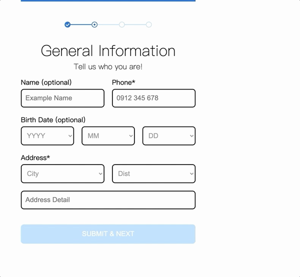

# 表單驗證與上傳圖片預覽
## 使用技術
- Vue Router
- Vuex

## 實現功能
- 進度條提示
- 資料格式不符警示
- 自動格式化手機號碼、信用卡號
- 上傳圖片預覽
- 阻擋非 png 格式檔案上傳
- 限制圖片尺寸不可超過 150*150
- 可選取單張或多張圖片上傳
- 至多上傳 3 張圖片
- 刪除圖片預覽
- 表單完成 5 秒後跳轉回首頁

## Demo

[demo](https://yachen168.github.io/Form-Validation/#/)

[設計稿](https://hexschool.github.io/THE_F2E_Design/week6-validation/#artboard6)